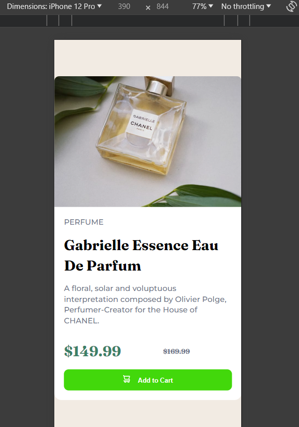

# Frontend Mentor - Product preview card component solution

This is a solution to the [Product preview card component challenge on Frontend Mentor](https://www.frontendmentor.io/challenges/product-preview-card-component-GO7UmttRfa). Frontend Mentor challenges help you improve your coding skills by building realistic projects.

## Table of contents

- [Overview](#overview)
  - [The challenge](#the-challenge)
  - [Screenshot](#screenshot)
  - [Links](#links)
- [My process](#my-process)
  - [Built with](#built-with)
  - [What I learned](#what-i-learned)
  - [Continued development](#continued-development)
  - [Useful resources](#useful-resources)
- [Author](#author)

## Overview

### The challenge

Users should be able to:

- View the optimal layout depending on their device's screen size
- See hover and focus states for interactive elements

### Screenshot




### Links

- Solution URL: ()
- Live Site URL: ()

### Built with

- Semantic HTML5 markup
- CSS custom properties
- Flexbox
- Google Fonts
- Media Queries

### What I learned

I learned how to use media queries effectively in order to make a website responsive. This allowed me to create the mobile design correctly.

Also i practiced my responsiveness problem solving skills by making this fully responsive alone.

```
@media (max-width: 620px) {

        .card {
            display: flex;
            flex-direction: column;
        }

        .main-section {
            display: flex;
            flex-direction: column;
            width: 100%;
            padding: 20px;
        }


        .img {
            display: none;
        }
        .img-2 {
            display: block;
            max-width: 100%;
        }
}
```

### Continued development

- I want to learn more about css by creating multi-page websites

### Useful resources

- (https://www.w3schools.com) - W3S helped me getting some help!

## Author

- Frontend Mentor - [@hassanmoaa](https://www.frontendmentor.io/profile/hassanmoaa)

```

```
